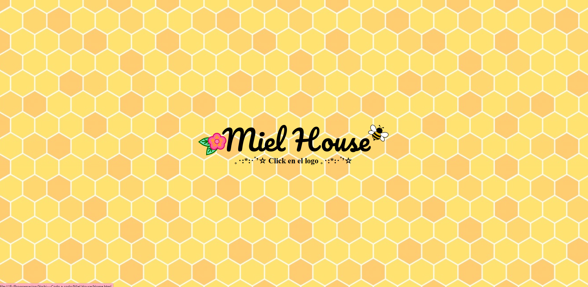
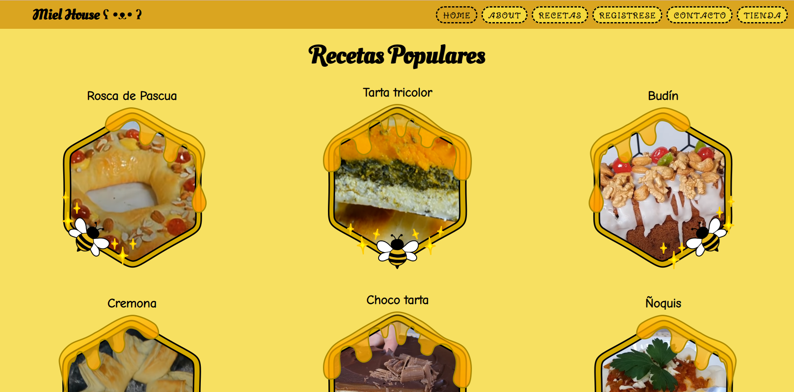
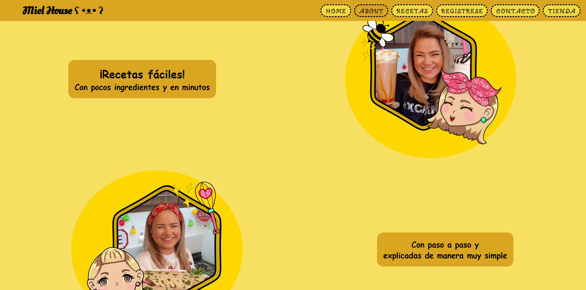
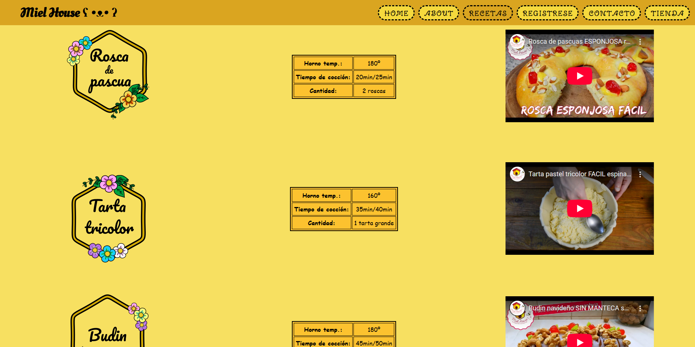
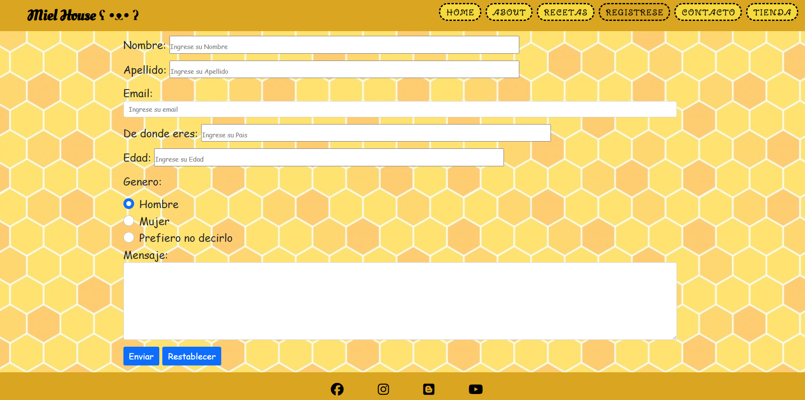
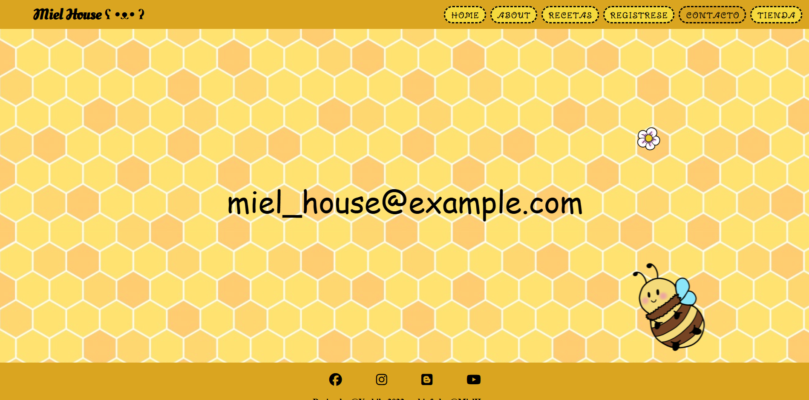

# PaginaWeb_MATAYOSHI_2022
Práctica formativa obligatoria-Realizando una página web para una youtuber sobre cocina.
FULL STACK PYTHON CODO A CODO.
Este es un proyecto web, desarrollado como práctica formativa del curso CODO a CODO
FULL STACK PYTHON. 
Incluye varios archivos html para la distinta navegación de la página como el home , recetas, about y formulario de contacto, entre otros.
Tambien posee animaciones y cambio de la estetica del cursor.

Tecnologías utilizadas: 

HTML5

CSS3 (con Media Queries para responsive design)

Font Awesome

JAVASCRIPTS 

